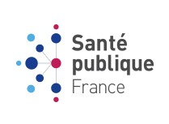

<h1>Projet 3: Concevez une application au service de la santé publique</h1>
  

<h2>Contexte et problématique du projet</h2>

L'agence "Santé publique France" a lancé un appel à projets pour trouver des idées innovantes d’applications en lien avec l'alimentation. Vous souhaitez y participer et proposer une idée d’application à partir du jeu de données Open Food Facts.

<h2>But et intérêt du projet</h2>

Traitement du jeu de données : https://world.openfoodfacts.org/

- Réfléchir à une idée d'application (application Nutri-Rein qui permet d'évaluer la qualité nutritionnelle des aliments par rapport au régime spécifique d'un insuffisant rénal) et déterminer les variables pertinentes pour cette application 
- Nettoyage des données en mettant en évidences les valeurs manquantes et en identifiant et quantifiant les valeurs aberrantes
- Automatisation des traitements sur le jeu de données
- détermination des ordres de grandeurs des indicateurs statistiques classiques pour les différentes zones géographiques et pays du monde (moyenne/médiane/écart-type par pays et par continent ou bloc géographique)

Analyse exploiratoire des données (EDA):

- Production de graphes, visualisations à partir des données
- Réalisation d'une analyse univariée et multivariée sur les variables intéressantes avec les tests statistiques approppriés

Justification de la faisabilité de l'application Nutri-Rein:
- Identification des arguments permettant d'établir la faisabilité de l'application
- Rédaction d'un rapport d'exploration et pitch de l'idée d'application

<h2>Compétences évaluées</h2>

- Effectuer une analyse multivariée
- Communiquer ses résultats à l’aide de représentations graphiques lisibles et pertinentes
- Effectuer une analyse statistique univariée
- Effectuer des opérations de nettoyage sur des données structurées

<h2>Contenu du dépôt GitHub</h2>

- README.md: fichier présentation projet

- sante_publique.jpg : image illustration README.md

- Répertoire "Notebooks":
  - fichier "PSante_01_nettoyage.ipynb": fichier notebook Jupyter en Python pour le nettoyage des données
  - fichier "PSante_02_analyse.ipynb": fichier notebook Jupyter en Python pour l'analyse des données
  
- Répertoire "Soutenance":
  - fichier "PSante_03_support_soutenance_ppt.ppt": fichier support soutenance projet Powerpoint
  - fichier "PSante_03_support_soutenance_pdf.pdf": fichier support soutenance projet PDF
  - fichier "projet_p3_oc_ds_1.mp4": video soutenance projet P3 (mp4)
  - fichier "projet_p3_oc_ds_2.mp4": video soutenance projet P3 - questions-réponses avec évaluateur (mp4)
  - fichier "Projet 3 valide - Concevez une application au service de la santé publique - OC.pdf": preuve de validation du projet P3
